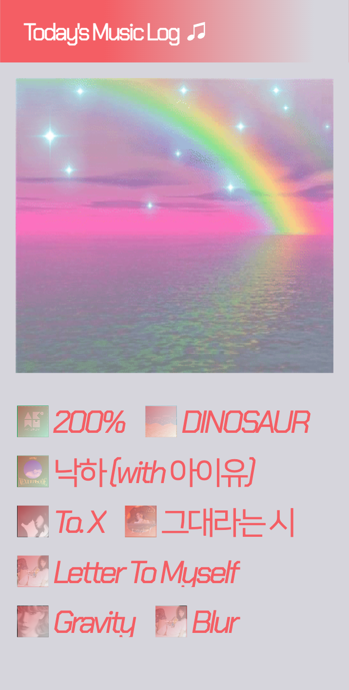

# Today's Music Log

The reason I chose music as the topic is that
I just wanted to use Album covers as a visual element.
And I thought using album covers would make my website look better.
With this idea, I will create a platform where
users can list their favorite songs of the day
and share the screenshots on their social media.

# URL

https://todays-music-log.vercel.app

# What I used

# Wireframe

# Screenshots

## 💎 Main Page

## 🌈 Header Buttons & PopUp

  
  
  

    
## ⚡️ How to Search
  
  

## ☂️ If you add musics...

## 🌏 If you hover on musics...

## 🌪️ You can also delete musics!

## 🍎 mobile version

 

  
  
  
  

## 🍭 if you click on the camera button, you can make the screenshot.

(these are the screenshots!)

  
  

  
  

# Future plan

### - try to change Main image (gif)
