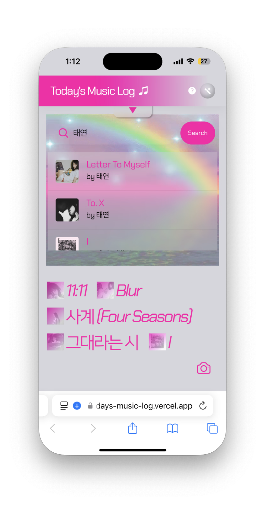

## Today's Music Log

The reason I chose music as the topic is that
I just wanted to use Album covers as a visual element.
And I thought using album covers would make my website look better.
With this idea, I will create a platform where
users can list their favorite songs of the day
and share the screenshots on their social media.

## URL

https://todays-music-log.vercel.app

## What I used

- Vite + Vanilla js
- Spotify API

## Wireframe

## Screenshots

- Main Page
  

- Header Buttons & PopUp
  
  

- How to Search
  

- If you add musics...
  

- If you hover on musics...
  
  

- You can also delete musics!
  

- mobile version
  
  
  
  

- if you click on the camera button, you can make the screenshot.
  (these are the screenshots!)
  
  
  
  
